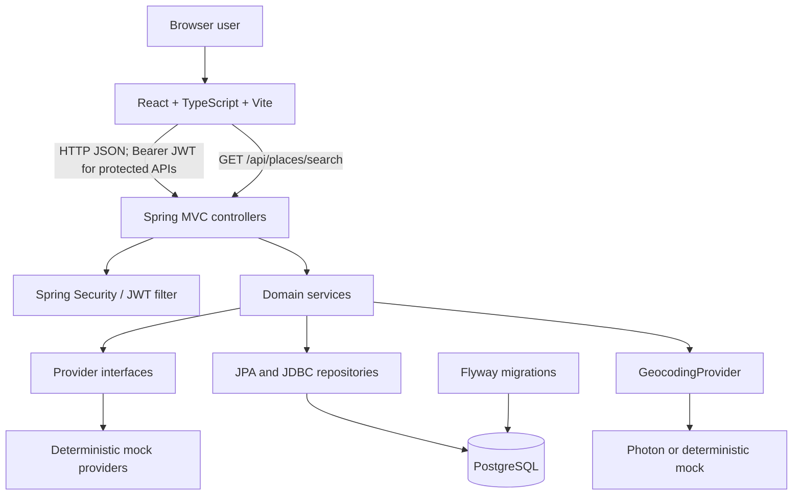
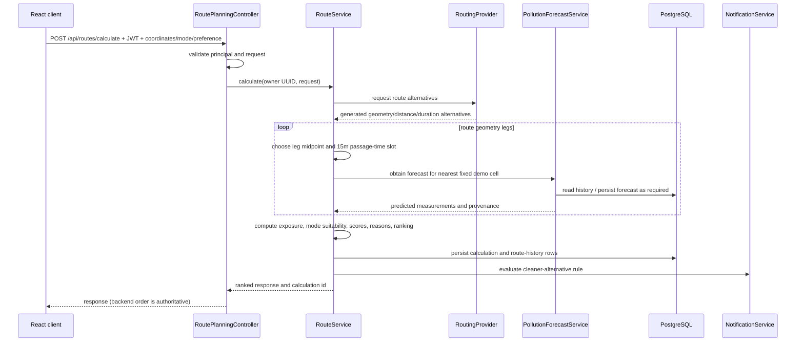
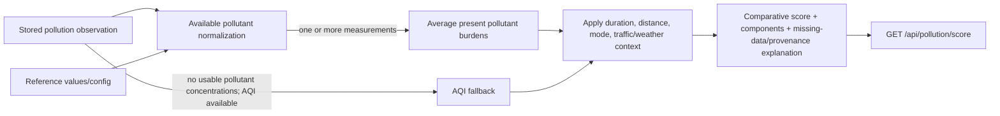
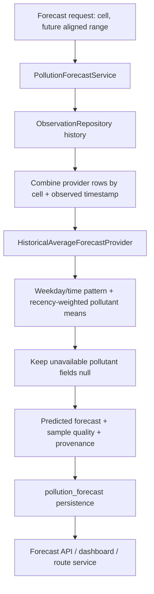
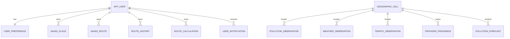

# CleanRoute Detailed Architecture

This reference describes current source and database behavior. The related [master handoff](PROJECT_HANDOFF.md) provides the phase overview and operational context.

## System shape

CleanRoute is a Spring Boot modular monolith. The browser frontend calls JSON REST endpoints. Spring controllers validate/authenticate and pass work to domain services. Services use provider interfaces and repositories; PostgreSQL stores users, route records, observations, forecasts, and notifications. No queues, cache service, microservices, PostGIS, or ML service are present.



Place search is proxied through the backend `GeocodingProvider`; normalized CleanRoute results are returned to the browser. Route geometry remains from the backend `RoutingProvider`; it is not returned by Photon.

## Backend package responsibilities

Root package: `com.cleanroute`.

| Package | Responsibility |
|---|---|
| `api` | Auth, health, account, saved-place, saved-route, and route-history controllers; shared API error mapping. |
| `security` | JWT generation/validation, bearer filter, stateless security policy, CORS. |
| `domain`, `repository` | Phase 2 JPA entities and Spring Data repositories. |
| `observation` | Observation/provider and routing models, AQI/weather/traffic/routing interfaces and mocks, ingestion scheduling, normalization, freshness, retrieval. |
| `pollution` | Pollutant normalization/score, forecast provider/service/repository, score and forecast APIs. |
| `route` | Route request/response domain, suitability config, route calculation and persistence. |
| `dashboard` | Authenticated aggregation of observations, forecasts, account-owned route data, and notifications. |
| `notification` | Notification models, rules, owner-scoped JDBC persistence, deduplication, in-app provider. |

JPA is used for user-owned Phase 2 entities. JDBC repositories are used where time-series or JSON payload queries are more direct (observations, freshness, forecasts, route calculations, notifications). Provider interfaces separate application policy from deterministic implementations.

## Dependency and persistence boundaries

Controllers own HTTP binding and boundary validation. Services own business rules. Provider adapters produce typed domain results; `ObservationNormalizer` checks provider identity, requested cell, timestamps, and numeric values before persistence. Repositories own SQL and database uniqueness/ownership predicates. The scheduler isolates provider/cell work, records attempt/success/failure freshness, and does not require a broker.

Transactions are applied around service/database write boundaries where declared; individual repository operations also rely on PostgreSQL statement atomicity and constraints. Do not infer that all multi-step reads/writes are one transaction; inspect the relevant service annotation before changing one.

## Authentication lifecycle

```mermaid
sequenceDiagram
  participant Browser
  participant Auth as AuthController
  participant Users as User repository
  participant JWT as JwtService
  participant API as Protected controller
  participant Filter as JwtAuthFilter
  Browser->>Auth: POST register or login
  Auth->>Users: store/find account
  Note over Auth,Users: Registration stores BCrypt hash; login verifies raw password against hash
  Auth->>JWT: issue signed token
  JWT-->>Browser: token + safe user DTO
  Browser->>Filter: request with Authorization: Bearer token
  Filter->>JWT: validate signature and expiry
  Filter->>API: authenticated principal (user UUID)
  API->>Users: owner-scoped service/repository query
```

The API does not accept an arbitrary owner UUID for protected operations. Controllers derive it from the authenticated principal. Public access is limited to health, authentication, AQI, pollution score, and forecast paths as configured; the remainder requires a valid JWT. JWT secret is supplied by configuration/environment, not source code. Token expiration defaults to 24 hours. There is no refresh/revocation endpoint.

## Request lifecycle and errors

Spring MVC binds path/query/body values, Bean Validation and controller/service checks reject malformed or out-of-range input, and `ApiExceptionHandler` maps expected application exceptions to JSON client errors. Missing required query parameters are expected to be 400. Unknown resources/cells are generally 404; unavailable source observations can return 404 or 422 according to endpoint contract. Unexpected failures are logged and become a generic 500 response without stack traces or credentials.

## Route calculation lifecycle



The route provider currently returns deterministic direct/north/south alternatives. Exposure is based on distance-weighted forecast samples; route preference and JOGGER/CYCLIST suitability are backend-calculated. The map draws returned geometry only. There is no street graph or actual navigation route. Route calculation requires authentication and stores user ownership from the principal.

### Ranking and suitability

FASTEST, CLEANEST, and BALANCED use service-level score/ranking policy. JOGGER and CYCLIST use Phase 7 suitability policy; JOGGER configurable weights include pollution, traffic, distance, and optional green-area coverage. CYCLIST component weights are fixed in implementation; optional cycling/elevation metadata contributes only if a provider supplies it. Mock routes do not provide those optional values. Missing optional metadata is described as unavailable, not filled with invented estimates.

## Pollution scoring flow



Null pollutants remain absent. The score API is an interval-based comparative calculation, not route ranking. Route exposure is separately calculated by `RouteService`; frontend code must not substitute local scoring.

## Forecast lifecycle



The implementation uses historical observations with a deterministic weighting/fallback strategy. Generated-source provenance is preserved; the result is a forecast model output, not a real provider observation or ML output.

## Dashboard and notification lifecycle

`GET /api/dashboard` gets the principal UUID and aggregates the central fixed cell's current/history/forecast data with the same user's saved places/routes/history and notification summary. Notification generation is evaluated during dashboard forecast generation and after route calculation, subject to preferences and configured thresholds. `NotificationProvider` currently resolves to `InAppNotificationProvider`; notifications are persisted in PostgreSQL, deduplicated by `(user_id, dedup_key)`, and have nullable `read_at`. Listing is owner-scoped; mark-read updates any matching owner/id pair, including older rows outside the list limit.

## Database relationship overview



All tables, columns, checks, and indexes are enumerated in [DATABASE_REFERENCE.md](DATABASE_REFERENCE.md). The cells are seeded/registered fixed demo identifiers from application code; arbitrary coordinate lookup and spatial SQL are not present.

## Frontend/backend interaction and state flow

```mermaid
sequenceDiagram
  participant UI as React App
  participant Search as Backend GeocodingProvider
  participant Photon
  participant Client as API client
  participant Backend as Spring Boot
  UI->>Search: query after debounce/min length
  Client->>Backend: GET /api/places/search?q=... (public)
  Backend->>Search: search(query)
  Search->>Photon: geocoding request
  Photon-->>Search: name, display context, coordinates
  Backend-->>Client: normalized place results + supportedArea
  Client-->>UI: suggestions; selected coordinates stored in state
  UI->>Client: route request + stored JWT
  Client->>Backend: authenticated JSON request
  Backend-->>Client: backend-ranked route response
  Client-->>UI: typed response
  UI->>UI: render returned geometry and route cards in response order
```

The frontend is currently a single main React application in `App.tsx`; API calls use the API client and token from browser storage where required. Place search is public and calls the backend endpoint; profile/preferences/saved data/dashboard/notifications use authenticated APIs. Place results identify whether they are near a fixed Delhi demo cell. The map uses React Leaflet/Leaflet and OpenStreetMap tiles. Errors/loading/empty states are rendered by UI components rather than raw server traces.

## Validation and persistence invariants

- User-owned DB reads/writes include principal-derived user UUID predicates.
- Database uniqueness backs up email, provider/cell/time observations, forecast key, and per-user notification deduplication.
- Observation and forecast timestamps use PostgreSQL `TIMESTAMP WITH TIME ZONE` and Java `Instant`/offset-aware API values.
- Cell coordinates and route coordinates have range checks; the MVP cells are a fixed set.
- Observation measurements can be null; invalid numeric provider values are rejected before write.
- Route requests are validated for coordinate ranges, supported enums, and date/duration/range restrictions.
- Mock provenance is retained in API/database models. Do not infer reality from a numeric value alone.

## Frontend details

See [FRONTEND_REFERENCE.md](FRONTEND_REFERENCE.md) for source tree, data flow, UI states, environment variables, and commands. Always inspect current Git state before relying on snapshots in [CURRENT_STATE.md](CURRENT_STATE.md).
